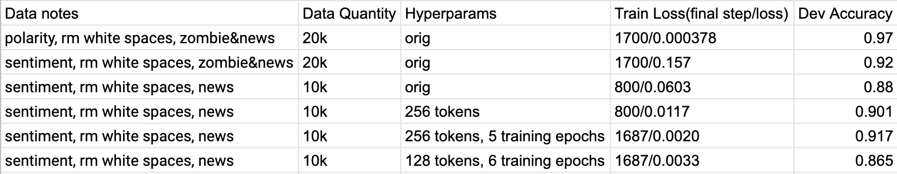

# Truthsayer
==============================

# Problem/Introduction

Detecting fake/real news is a challenging problem and one w/ particular relevance as propaganda has become prevalent.  We see zombie sites appearing via grassroot projects such as [MassMove](https://github.com/MassMove/AttackVectors).  Additionally, we are challenged by the notion of an objective truth that does not contain a highly polarized political bias.

Further, while the idea of objective truth is attractive it is problematic as objective real world ground truth is difficult to determine.    

## Past work

We have some tools we can use e.g. [academic classes](https://callingbullshit.org) and other apps like [credder](https://credder.com/) and non profits such as [fullfact](https://fullfact.org).  There is past work being done in automating this detection of fake news [Wang 2017, Zellers 2019, Pérez-Rosas 2017].

Significant work has been done in the area of Sarcasm and Sentiment detection in NLP(e.g. [Poria 2016]).  Significantly, we can also detect political bias [Rao 2016].

# Approach

BERT[Devlin, 2018] has shown superior results in Sentiment Detection and other NLP tasks.  We use this as a base and train our data and use it to make predictions on data it hasn't seen.

A lot of code was based on the BERT Colabatory [notebook](https://colab.research.google.com/github/tensorflow/tpu/blob/master/tools/colab/bert_finetuning_with_cloud_tpus.ipynb) and [Simple Bert using TensorFlow 2.0](https://towardsdatascience.com/simple-bert-using-tensorflow-2-0-132cb19e9b22) and [BERT github repo](https://github.com/google-research/bert)

Keep in mind this is all WIP and proof of concept so there are a lot of rough edges

## Data Sources

Data is available in a variety of places.  We use newspaper3k to scrape sites and manually score the site based on credibility.

* zombie sites
* regular news sites

## Model Training Runs

Trained several different models w/ different variation

* polarity vs sentiment: using polarity(simply a boolean for whether it was fake news or not) and sentiment which used a numerical value to determine the credibility of news source.  
* regular sites vs regular sites + zombie sites:  zombie sites are sites from the mass move list.  regular sites are just regular news sites
* removing extra white spaces for data:  formatting and other tokens may leave signatures as to which news site the source text is from
* varying the number of tokens:  the number of tokens from the news article data that is used.

# Results

A full exploration of the hyper-parameter space is needed to optimized test accuracy.  However, these results show two thing:

1.  A relatively high dev accuracy
2.  More data increases the accuracy

# Conclusions

The high accuracy lends credibility to the idea that political bias is detectable.

# Additional Resources

* [fake news class](https://callingbullshit.org)
* [how people consume news](http://www.digitalnewsreport.org/survey/2019/how-younger-generations-consume-news-differently/)
* [zombie sites from MassMove](https://github.com/MassMove/AttackVectors)
* [app/site for news credibility](https://credder.com/)
* [fake news dataset](https://github.com/klout/opendata/tree/master/political_leaning)
* [scraping news sites](https://newspaper.readthedocs.io/en/latest/)
* [Discussion of Transformers](https://towardsdatascience.com/transformer-attention-is-all-you-need-1e455701fdd9)

# References

FullFact.org. (2020, May 5) https://fullfact.org

Devlin, Jacob, et al. "Bert: Pre-training of deep bidirectional transformers for language understanding." arXiv preprint arXiv:1810.04805 (2018).

Pérez-Rosas, Verónica, et al. "Automatic detection of fake news." arXiv preprint arXiv:1708.07104 (2017).

Peters, Matthew E., et al. "Deep contextualized word representations." arXiv preprint arXiv:1802.05365 (2018).

Poria, Soujanya, et al. "A deeper look into sarcastic tweets using deep convolutional neural networks." arXiv preprint arXiv:1610.08815 (2016).

Rao, Adithya, and Nemanja Spasojevic. "Actionable and political text classification using word embeddings and LSTM." arXiv preprint arXiv:1607.02501 (2016).

Vaswani, Ashish, et al. "Attention is all you need." Advances in neural information processing systems. 2017.

Wang, William Yang. "" liar, liar pants on fire": A new benchmark dataset for fake news detection." arXiv preprint arXiv:1705.00648 (2017).

Zellers, Rowan, et al. "Defending against neural fake news." Advances in Neural Information Processing Systems. 2019.
